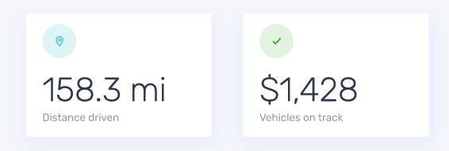

# Content day 1

## Exam

Yêu cầu:

- Tạo component bằng React.createElement
- Có sử dụng `props` để config được các phần như icon, title, sub-title
- Nộp bài qua github của bạn hoặc https://stackblitz.com/